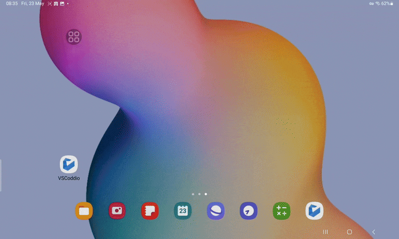

# VSCoddio

VSCoddio is a custom VSCode wrapper app for Android. It uses a WebView component to let you load VSCode for the web, but differs from using a standard browser in that it includes optimizations for mobile devices, such as fixing infamous issues with virtual keyboards.  
The app can be used to load any web VSCode instance; by default it lets you use vscode.dev, which requires no further configuration and should also work offline, but you can also add any other instance by URL, such as a self-hosted code-server.

## Third-Party Component & Thanks

* Custom WebView component: [SpaccWebView for Android](https://gitlab.com/SpaccInc/SpaccDotWeb/-/tree/main/SpaccDotWeb.Android)
* App icon: VSCodium icon proposal by paulo22d/@psergiojr, used under CC BY-SA 4.0 (https://github.com/VSCodium/icons#shapes)
